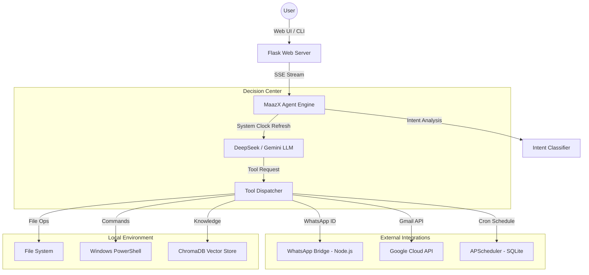

# 🦁 MaazX Autonomous AI Agent — v3.5

 <!-- Note: Add a banner image if you have one, or remove this line -->

**MaazX** is a high-performance, fully autonomous AI engineering agent designed to bridge the gap between Large Language Models and local system environments. Built on a multi-modal foundation, MaazX can read code, manage files, search the web, control system resources, and interact with real-world communication channels (WhatsApp, Gmail) autonomously.

---

## 🏗 Architecture Overview

MaazX operates on a **Reactive Tool-Calling Loop**. Unlike static chatbots, MaazX maintains a persistent state and a live connection to a suite of system-level tools.



### Key Components:
- **Core Engine**: Orchestrates the multi-turn conversation and tool execution logic.
- **Dynamic System Clock**: Injects real-time system timestamps into every prompt to ensure 100% scheduling accuracy.
- **Autonomous Scheduler**: A background service that persists and executes tasks (e.g., cron jobs) even when the main UI is closed.
- **WhatsApp Bridge**: A Node.js middleware utilizing `whatsapp-web.js` for seamless instant messaging.
- **RAG Knowledge Base**: A vector-indexed store for processing uploaded documents (PDFs, Docs, etc.).

---

## 💎 Core Capabilities

### 📂 File System & Engineering
- **Atomic Edits**: Targeted line-level replacements via `patch_file` and `edit_file`.
- **Codebase Mapping**: Recursive directory scanning and semantic search.
- **Git Integration**: Full version control management (commit, branch, push).

### 📱 Real-World Sync
- **WhatsApp Bridge**: Send messages, search contacts, and manage block lists.
- **Gmail Automation**: Send emails, read threads, and manage labels.
- **Web Browser**: Full automation for scraping, clicking, and interacting with web apps.

### 🕒 Autonomous Scheduling (V3.5 Exclusive)
- **Active Tasks**: Schedule one-time or recurring tasks using natural language.
- **Execution History**: Persistent logging of all finished tasks, including success/failure status and response data.
- **Year-Lock (2026)**: Hardcoded time-awareness to prevent past-date scheduling errors.

### 💻 System Intelligence
- **PC Control**: Execute shell commands, monitor system health, and capture webcam snapshots.
- **Vision Intelligence**: Analyze screenshots and UI layouts for debugging.
- **Memory store**: Persistent fact-storage across chat sessions.

---

## 🚀 Getting Started

### 1. Prerequisites
- **Python 3.10+** (System architecture requires `pip` for dependencies).
- **Node.js 18+** (Required only for the WhatsApp Bridge).
- **DeepSeek/Gemini API Key**.

### 2. Installation

1. **Clone & Install Python Dependencies**:
   ```powershell
   git clone <repository-url>
   cd "AI Agnet"
   pip install -r requirements.txt --break-system-packages
   ```

2. **Configure Secrets**:
   Create a file named `agent_secrets.env` in the root directory:
   ```env
   ANTIGRAVITY_GEMINI_API_KEY=your_gemini_key
   ANTIGRAVITY_DEEPSEEK_API_KEY=your_deepseek_key
   ```

3. **Initialize WhatsApp Bridge (Optional)**:
   ```powershell
   cd whatsapp_bridge
   npm install
   node bridge.js
   ```

### 3. Running the Agent
Start the Flask Web Server:
```powershell
python web_app.py
```
Open your browser to `http://localhost:5000`.

---

## 🎨 Professional Web UI
The MaazX interface is designed for speed and transparency:
- **Streaming Response**: Real-time text generation with live thinking indicators.
- **Tool Traces**: Watch every bash command and tool call as it happens.
- **Scheduled Tasks View**: A dedicated dashboard to monitor and cancel upcoming background jobs.
- **Health Monitor**: Real-time status of API connections and system resources.

---

## 🛠 Extending MaazX
Adding a new capability is simple:
1. Create a new Python file in `/tools/`.
2. Define your function and its arguments.
3. Register the tool in `core/tool_registry.py`.
4. The agent will automatically interpret its purpose and start using it appropriately.

---

## 📜 License
MaazX is licensed under the MIT License. Built with ❤️ for autonomous engineering.

---
*Created by the MaazX Team — Empowering your local workspace with AI Agency.*
