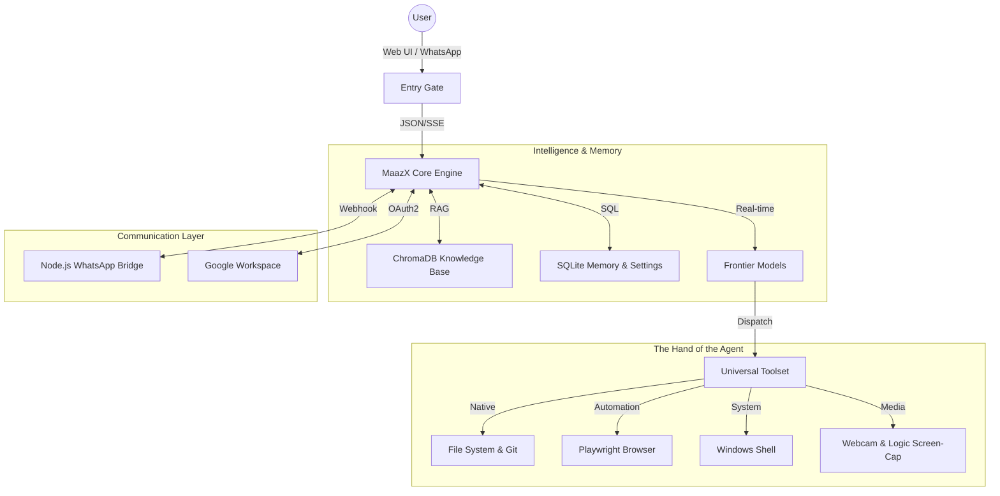

# 🦁 MaazX Autonomous AI Agent — v3.8 (Enterprise Manual)


**MaazX** is a production-grade, fully autonomous AI engineering agent. It resides directly on your hardware, bridging the intelligence of frontier Large Language Models (DeepSeek, Gemini, Ollama) with the raw power of your local operating system.

Unlike traditional chat interfaces, MaazX is an **active participant** in your development cycle. It doesn't just suggest code; it reads your filesystem, interprets logic patterns, executes PowerShell commands, manages your Git state, and communicates results through encrypted WhatsApp and Gmail channels.

---

## � Deep Architecture: The Reactive Tool-Calling Loop

The core of MaazX is based on a **perpetual observation-action cycle**. Every user request is processed as a "Goal," and the agent iteratively selects the best tools to achieve it.


### 🔄 The Execution Lifecycle
1.  **Intent Classification**: MaazX uses a lightweight classifier to determine if a request is purely conversational (Chat Mode) or requires system access (Agent Mode).
2.  **System Clock Injection**: A dynamic "Master Clock" is injected into every prompt. This ensures the agent is aware of the exact current second, year (2026), and local timezone before proposing any sensitive scheduling action.
3.  **Autonomous Tool Dispatch**: The LLM emits a `tool_call`. MaazX intercepts this call, executes the logic in a secure Python sub-process, and feeds the *raw output* (stdout/stderr) back to the LLM.
4.  **Refinement Loop**: If a tool fails (e.g., a regex match misses), MaazX analyzes the error, adjusts its parameters, and retries with a broader context—automatically.

### 🗺 System Map


---

## 🛡 Security & Operational Protocols

MaazX adheres to a strict set of **Absolute Engineering Rules** (defined in `config.py`) that prioritize safety and accuracy:

*   **Rule 01: Read Before Write**: The agent is physically blocked from editing any file it has not read in the current session. This prevents "blind overwriting."
*   **Rule 02: Atomic Patching**: For large files, MaazX uses a patch-and-apply logic rather than full rewrites. This preserves metadata and prevents accidental deletion of unrelated code.
*   **Rule 03: Precision Scheduling**: The agent enforces a "Year-Lock (2026)" protocol. Any task scheduled for a past date is caught by a pre-execution safety layer and rejected.
*   **Rule 04: Absolute Paths Only**: To prevent directory traversal errors or confusion across different PowerShell contexts, every tool call must use a fully-qualified absolute path.

---

## � Advanced Capabilities & Integration

### � Engineering Intelligence
- **Semantic Code Search**: Using ChromaDB, MaazX can find "The function that handles JWT signatures" even if you don't know the filename.
- **Autonomous Refactoring**: Give a goal ("Convert this whole module to use async/await"), and MaazX will map dependencies, plan the order of edits, and execute the migration.
- **Vision Debugging**: MaazX can capture your screen, send it to a Vision-Enabled model, and debug UI layout alignment issues in real-time.

### 🕒 The Autonomous Scheduler (v3.8)
MaazX features a persistent background daemon that lives in `core/scheduler.py`.
- **Persistent Jobs**: Scheduled tasks are stored in `agent_data.db`. If you restart your PC, MaazX resumes its schedule automatically.
- **Execution History**: A transparent log of every "Recently Executed" task is visible in the UI, showing exactly what the agent said and did while you were away.
- **History Slicing**: Control how much context is kept to prevent token-overflow while maintaining long-term memory.

### � Real-World Connectivity
- **WhatsApp Bridge (Node.js)**: A standalone middleware using `whatsapp-web.js`. It handles QR-code login and bidirectional webhooks.
- **Gmail Automation**: Full integration with the Gmail API for professional correspondence and automated report distribution.

---

## ⚙️ Setup & Configuration

### 1. Minimal Prerequisites
- **Python 3.10+** (Added to PATH)
- **Node.js 18+** (For WhatsApp)
- **Git** (For autonomous version control)

### 2. Fast-Path Installation
```powershell
# 1. Clone the core
git clone <repository-url> "MaazX-Agent"
cd "MaazX-Agent"

# 2. Build the Python Environment
pip install -r requirements.txt --break-system-packages

# 3. Setup Secrets
# Create agent_secrets.env with:
# ANTIGRAVITY_GEMINI_API_KEY=xxx
# ANTIGRAVITY_DEEPSEEK_API_KEY=xxx
```

### 3. Launching the MaazX Hub
```powershell
# Start the web interface
python web_app.py
```
MaazX will be live at `http://localhost:5000`. 

*Note: For first-time WhatsApp use, the Node bridge will output a QR code in the terminal. Scan it to link your account.*

---

## 🛠 Developer Guide: Creating Custom Tools

Extending MaazX's power is designed for developers. 

**Structure of a Tool (`/tools/my_new_tool.py`):**
```python
def my_capability(param: str) -> str:
    """
    Docstrings are CRITICAL. The LLM reads this to understand WHEN to use this tool.
    Explain the parameters and the expected return value clearly.
    """
    try:
        # Your logic here
        return "Transformation complete: " + param
    except Exception as e:
        return f"Error: {e}"
```

Once saved, register it in `core/tool_registry.py` and the agent will immediately begin incorporating it into its problem-solving logic.

---

## � Roadmap & Versioning
- **v3.5**: Rebranding completion and UI Streaming.
- **v3.8**: **(Current)** Real-time Clock Sync, Persistent Job History, and Master Technical Manual.
- **v4.0**: (Planned) Multi-Agent Swarm logic and Voice-Activated Commands via Whisper.

---
**MaazX** — *The future of local engineering agency.*
*Developed by the Abdullah Masood. Powered by Advanced Intelligence.*
